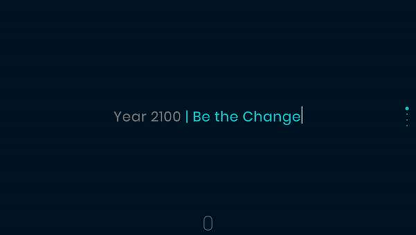
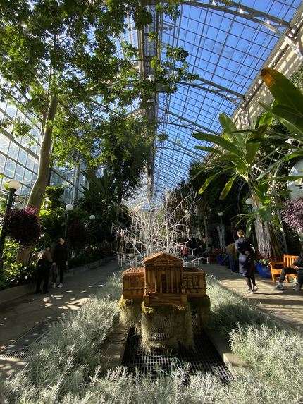
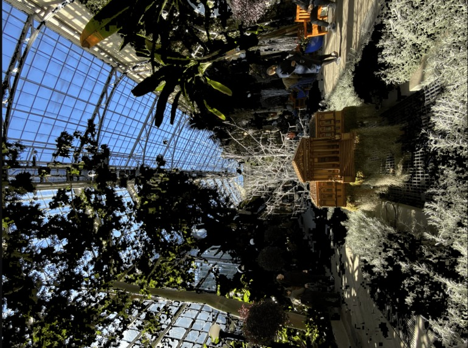

# 2100
https://devpost.com/software/2100 

The Year 2100 - showing you your own future.

A Flask app where you upload an image of your neighborhood (anything outside basically) and input location data that fetches weather data via an API. 
The image you upload is transformed and modified to show you what it might look in 2100.

The Homepage

Before

After

Special thank you to gxercavins. We used his public repo as a base to learn Flask and Image Modification API's 
https://github.com/gxercavins/image-api
